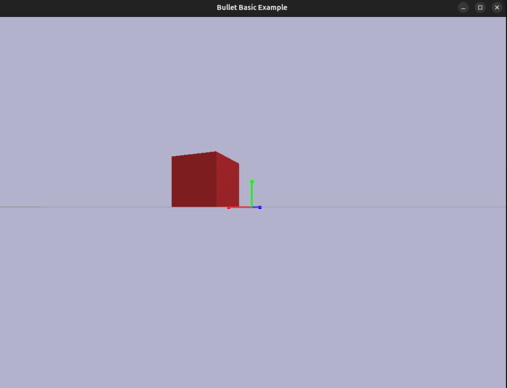
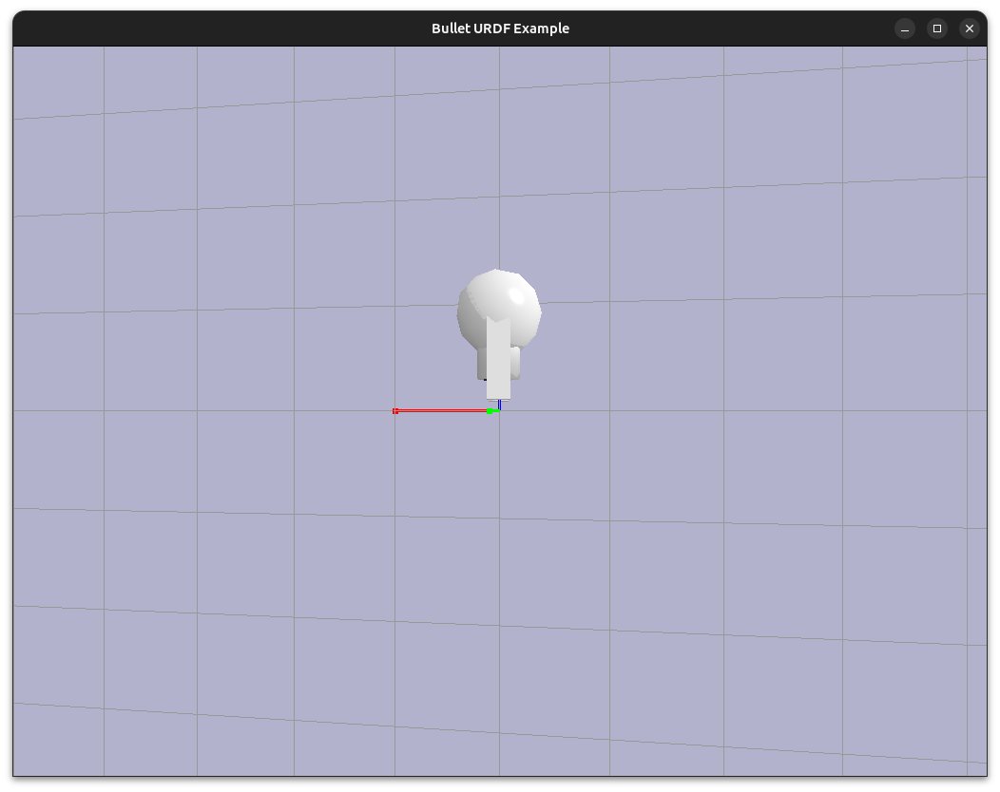
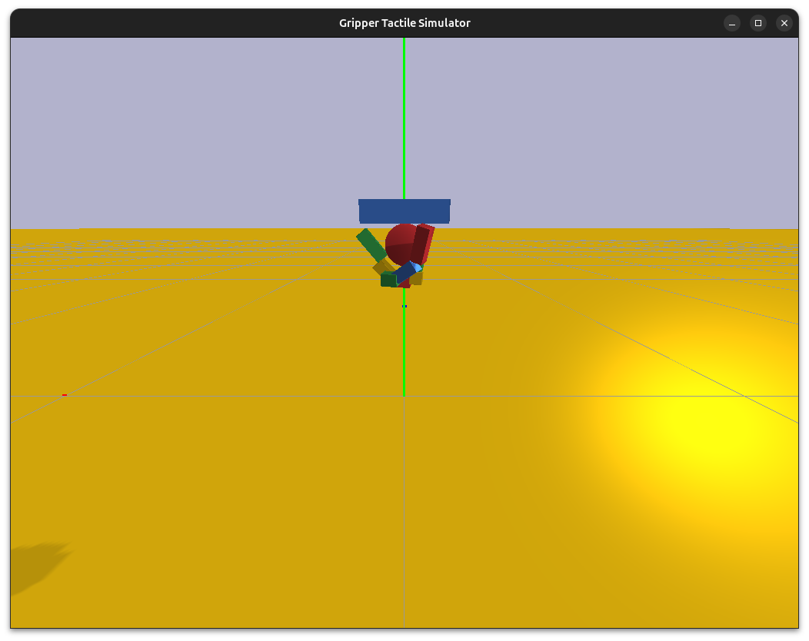

# Bullet Physics + OpenGL Boilerplate

This project provides a boilerplate for creating physics simulations using the Bullet Physics engine and rendering them with OpenGL. It includes the `bullet3` repository as a submodule and provides two examples.

## Prerequisites

- CMake (>= 3.10)
- C++ Compiler (C++14 or later)
- OpenGL
- GLEW
- Git

## Setup

1.  Clone the repository with submodules:
    ```bash
    git clone git@github.com:dhruv0000/bullet-sims.git
    cd bullet-sims
    ```
    If you already cloned without submodules:
    ```bash
    git submodule update --init --recursive
    ```

2.  Build the project:
    ```bash
    mkdir build
    cd build
    cmake ..
    make -j4
    ```

## Examples

### Example 1 & 2: Basic Simulation & URDF Simulation

A simple simulation with a ground plane and a falling box.
```bash
./build/bin/example_basic
```




Loads a URDF file (R2D2) and simulates it.
**Note**: You need to provide the `r2d2.urdf` file in the working directory or run it from root folder like shown below.
For testing, you can copy it from the bullet3 submodule:
```bash
./build/bin/example_urdf
```



### Example 3: Gripper Tactile Simulation

A simulation of a robotic gripper with tactile sensing capabilities. It features soft fingers and extracts "neural data" like contact forces and torques.



For more details, see the [Gripper Tactile Simulator README](src/gripper_tactile/README.md).


## Adding New Simulations

1.  Create a new directory in `src/` (e.g., `src/my_sim`).
2.  Add your `main.cpp` and other sources.
3.  Update `CMakeLists.txt` to add a new executable target:
    ```cmake
    add_executable(my_sim src/my_sim/main.cpp)
    target_link_libraries(my_sim
        bullet_helpers
        Bullet3Common
        BulletCollision
        BulletDynamics
        LinearMath
        OpenGL::GL
        GLEW::GLEW
    )
    ```
4.  Re-run CMake and build.
